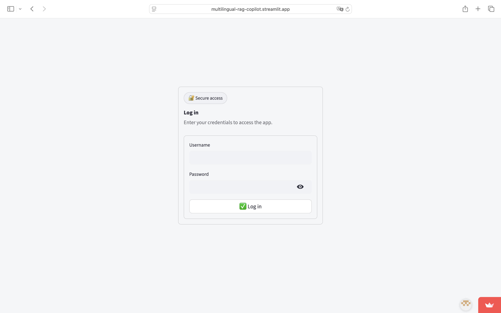

# Multilingual-RAG-Copilot 🌍📚

Bienvenue dans **Multilingual-RAG-Copilot**, une application de génération augmentée par récupération (**RAG - Retrieval-Augmented Generation**) multilingue conçue pour vous permettre de télécharger (ou de monter) des documents et de poser des questions basées sur les informations contenues dans ces documents, avec des **citations** précises.

## Fonctionnalités 
- **Téléchargement** de plusieurs types de documents : **PDF, TXT, MD, DOCX**
- Construction locale d'index vectoriels avec **ChromaDB**
- Questions possibles dans **toutes les langues**
- Réponses fournies dans la **même langue que la question posée**
- Affichage des **sources** (document + fragment spécifique extrait)

## Technologies utilisées
- **Python** pour le traitement d'application principale
- **Streamlit** pour l'interface utilisateur (déploiement simple avec URL publique)
- **Groq API** en tant que backend pour les modèles de langage (LLM – Large Language Models)
- **ChromaDB** pour l'indexation vectorielle 
- **bcrypt** pour le stockage sécurisé de mot de passe 
- **MLflow** pour le suivi des performances et des métriques d'utilisation
- Optionnel : Airflow pour reindexer de manière planifiée, via des DAGs gérés localement.

## Informations de connexion (default)
- **Username** : `admin`
- **Password** : `admin-admin`

> Vous pouvez changer le mot de passe en générant un nouveau **hash bcrypt**. Consultez la partie _Secrets (Local)_ ci-dessous.

## Déploiement

L'application est déployée publiquement sur Streamlit Cloud via l'URL ci-dessous :

🔗 **https://multilingual-rag-copilot.streamlit.app/**

## Aperçu de l’application

### Page de connexion
Interface d’authentification sécurisée avant l’accès à l’application.



---

### Chargement de documents
Chargement et ingestion des documents dans le moteur RAG.


---

### Question & Réponse intelligente
L’utilisateur pose une question dans n’importe quelle langue à partir des documents chargés.
La réponse est générée automatiquement dans la langue de l’utilisateur, avec les sources clairement citées.


---

### Exécution rapide en local
Pour une exécution locale simple, suivez les étapes suivantes :
```bash
python3 -m venv .venv
source .venv/bin/activate
pip install -U pip
pip install -e .
streamlit run app.py
```

#### Secrets (configuration locale)
1. Créez un fichier suivant `.streamlit/secrets.toml` :
```toml
GROQ_API_KEY = "votre_clef"
AUTH_USERNAME = "admin"
AUTH_PASSWORD_HASH = "$2b$12$..."  # Généré via bcrypt
```
2. Générer un hash bcrypt sécurisé pour un mot de passe : 
```bash
python scripts/hash_password.py "votre_password"
```

### Exemple via Airflow (optionnel)
Pour **re-indexer périodiquement vos documents**, vous pouvez configurer **Airflow localement** :
- Un exemple de DAG est disponible dans `dags/reindex_docs.py`
- Lancer l'exécution avec `docker-compose.airflow.yml`

## Suivi des métriques (MLflow)
L'intégration de MLflow est incluse pour :
- Le suivi des processus d'indexation : nombre de documents et chunks, modèle d'embedding
- Le suivi des performances de l'application : latence et chunks récupérés

Pour l'activer :
- Configurez `MLFLOW_TRACKING_URI` (localement)
- Définissez votre expérience via le secret/env `MLFLOW_EXPERIMENT`

## Structure du projet
```
multilingual-rag-copilot/
├─ app.py
├─ src/mrc/              # modules principaux
├─ corpus/               # documents montés (non suivis par le git)
├─ storage/              # persistance Chroma (non suivie)
├─ dags/                 # DAGs optionnels pour Airflow
├─ scripts/              # scripts utilitaires
├─ pyproject.toml
└─ requirements.txt      
```

## Limitations
- Les images, vidéos et fichiers audio ne sont **pas pris en charge** dans cette version.
- Pour une version totalement hors ligne, utilisez le backend **Ollama localement**.

